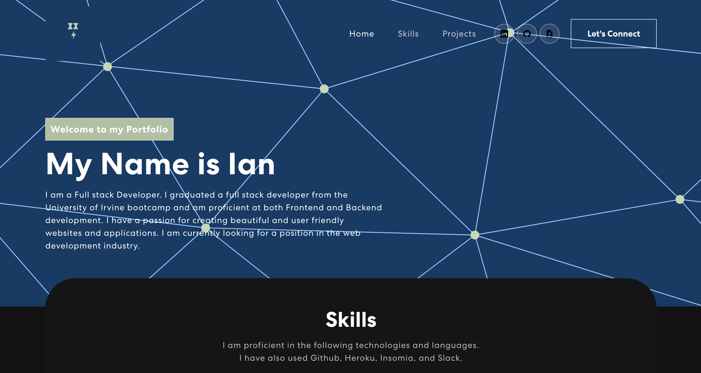

# React-Portfolio

## Table of Contents 📑

- [Description](#description)
- [Application Preview](#application-preview)
- [Links](#links)
- [Technologies](#technologies)
- [Questions](#questions)
- [License](#license)

## Description

Create a react Portfolio

## Application Preview

    

## Links

- Deployed link:

- Github Repository: https://github.com/Ianirwin18/React-Portfolio

## Technologies

- React
- Bootstrap Icons

## Questions

- Github Link: https://github.com/Ianirwin18
- Email: Ianirwin18@gmail.com

## License

- Licensed under the: [MIT License](https://opensource.org/licenses/MIT)
